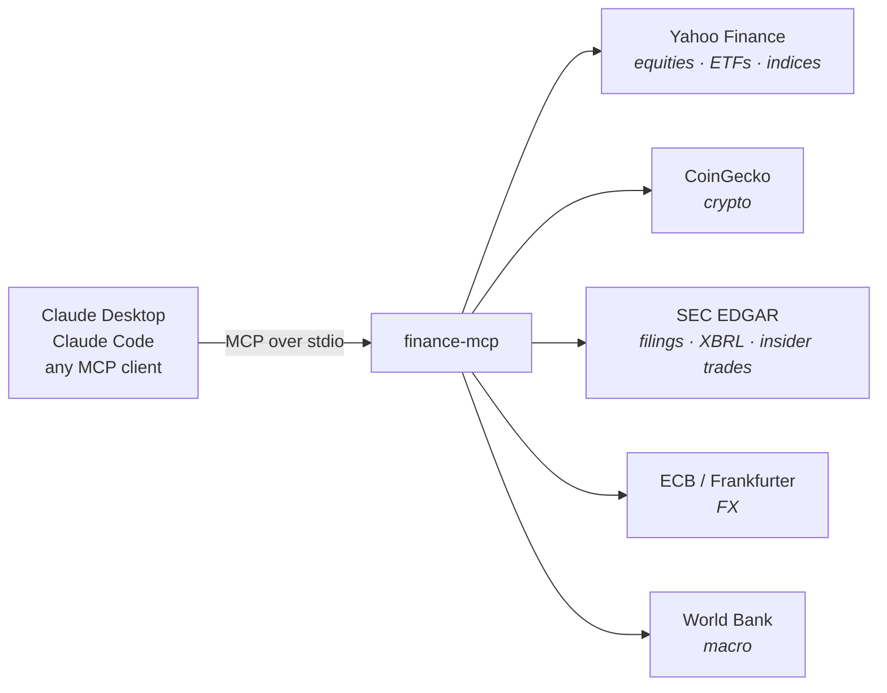

<div align="center">

# finance-mcp

**Live financial data for any LLM agent.**
Stock quotes · crypto · SEC filings · **insider trades** · XBRL financials · FX · macro

[](https://github.com/adididitagain/finance-mcp/actions/workflows/ci.yml)
[](https://www.npmjs.com/package/finance-data-mcp)
[](LICENSE)
[](https://nodejs.org)
[](https://modelcontextprotocol.io)
[](#data-sources)
[](#tools)


</div>

---

## Why

Most finance APIs want a signup, a key, and a credit card before your agent can answer *"what's Apple trading at?"*

`finance-mcp` wraps five genuinely free public sources behind eleven MCP tools. No key for any of them. The only configuration is an email address, and only because the SEC insists on one.

### The one you can't get anywhere else

Company insiders — officers, directors, 10% owners — must report every trade in their own stock to the SEC within **two business days**. It's public, it's structured, and essentially nobody reads it.

The catch is that most of it means nothing. Options vest. Shares get withheld to pay the tax on that vesting. None of it is a decision, and all of it gets reported as "insider selling."

`get_insider_activity` separates the two. Real output, Apple, one week in June:

```
OPEN-MARKET (a deliberate decision to trade)
  Sold:   5 filing(s)   302.92K shares   ≈ $87,566,268.55

MECHANICAL (vesting, option exercises, tax withholding — no decision): 1 filing(s)

  Newstead Jennifer — SVP, GC and Secretary
      2026-06-15  +30.10K @ —         Option exercise / conversion
      2026-06-15  −16.24K @ $296.42   Shares withheld for taxes      ← not a trade

  LEVINSON ARTHUR D — Director
    ★ 2026-05-06  −149.53K @ $284.57  Open-market sale               ← a real decision
    ★ 2026-05-06  −100.47K @ $285.04  Open-market sale
      2026-05-06  −5.00K   @ —        Gift
```

Same company, same month. One of those is a signal; the other is payroll. Every row links to the filing it came from.

> It reports what was disclosed and does not interpret it. Insider buying and selling both have innocent explanations, and neither predicts the share price.

### So we measured how often it matters

That claim is testable, so we tested it: every Form 4 filed by an insider at an S&P 100 company over twelve months — 2,969 filings — classified by whether the filing contains an actual decision to trade.


**Roughly seven in ten insider filings contain no decision to trade at all.** At the median company it's 83%.

A second result surprised us more. Corporations file Form 4s too, as 10% owners — and **53 filings, 1.8% of the sample, accounted for 65% of every disposed share.** The largest single "insider" in the data was Honeywell International Inc, disposing of 317M shares of a company it was spinning off. Rank insiders by share count and the top of the list isn't people.

Method, caveats and the raw data are in [`analysis/`](analysis/). It re-runs from scratch with two commands.

## Tools

| Tool | What it does |
|------|--------------|
| `get_stock_quote` | Current price, day/52-week range, volume — stocks, ETFs, indices |
| `get_price_history` | OHLCV candles plus period return and high/low summary |
| `search_symbols` | Resolve a company name to a ticker |
| `get_fx_rate` | Currency conversion at ECB reference rates |
| `get_crypto_price` | Spot price, 24h change, market cap, volume |
| `get_crypto_market` | Top coins ranked by market cap |
| `get_insider_activity` | **Form 4 insider trades — open-market decisions separated from vesting/tax noise** |
| `get_sec_filings` | Recent EDGAR filings with direct document URLs, filterable by form |
| `get_sec_financials` | As-filed XBRL line items as a time series |
| `search_sec_filings` | Full-text search across every EDGAR filing since 2001 |
| `get_economic_indicator` | World Bank macro series — GDP, inflation, unemployment, debt, trade |

## How it fits together



The shared HTTP layer paces requests per host, retries `429`/`403`/`5xx` with exponential backoff, honours `Retry-After`, and caches responses in memory — 30s for quotes, hours for filings and macro series.

## Quickstart

<details open>
<summary><b>Claude Code</b> — no clone needed</summary>

```bash
claude mcp add finance -e SEC_USER_AGENT="Your Name your@email.com" -- npx -y finance-data-mcp
```
</details>

<details>
<summary><b>From source</b></summary>

```bash
git clone https://github.com/adididitagain/finance-mcp.git
cd finance-mcp
npm install
npm run build
claude mcp add finance -e SEC_USER_AGENT="Your Name your@email.com" -- node "$(pwd)/dist/index.js"
```
</details>

<details>
<summary><b>Claude Desktop</b></summary>

Add to `claude_desktop_config.json` — on macOS, `~/Library/Application Support/Claude/claude_desktop_config.json` — then restart the app:

```json
{
  "mcpServers": {
    "finance": {
      "command": "npx",
      "args": ["-y", "finance-data-mcp"],
      "env": {
        "SEC_USER_AGENT": "Your Name your@email.com"
      }
    }
  }
}
```

To run from a local clone instead, use `"command": "node"` with `"args": ["/absolute/path/to/finance-mcp/dist/index.js"]`.
</details>

<details>
<summary><b>Any other MCP client</b></summary>

The server speaks MCP over stdio. Run `node dist/index.js` and point your client at it.
</details>

## Try it

> What's Apple trading at?
>
> Compare BTC and ETH over the last 24 hours.
>
> Show me Microsoft's revenue for the last 5 years from their filings.
>
> What 8-Ks has Tesla filed recently?
>
> Which companies mention "quantum computing" in their 10-Ks?
>
> What's India's GDP growth been over the past decade?
>
> Convert 5000 USD to JPY.
>
> Are Apple insiders actually selling, or is that just vesting?

## Data sources

| Source | Used for | Key required |
|--------|----------|--------------|
| [Yahoo Finance](https://finance.yahoo.com) | Equities, ETFs, indices, exotic FX | No |
| [CoinGecko](https://www.coingecko.com/en/api) | Cryptocurrency | No |
| [SEC EDGAR](https://www.sec.gov/edgar) | Filings, XBRL financials, Form 4 insider trades | No (User-Agent required) |
| [Frankfurter](https://frankfurter.dev) / ECB | FX reference rates | No |
| [World Bank](https://data.worldbank.org) | Macroeconomic indicators | No |

## Configuration

| Env var | Required | Purpose |
|---------|----------|---------|
| `SEC_USER_AGENT` | For SEC tools | EDGAR [requires](https://www.sec.gov/os/webmaster-faq#developers) a User-Agent with a real name and email on every request, and returns **403** without one. Format: `"Your Name your@email.com"`. |

> [!IMPORTANT]
> MCP clients do **not** pass your shell environment to the server. Set `SEC_USER_AGENT` in the client config shown above, not in `.zshrc`.

## Development

```bash
npm run dev      # tsc --watch
npm test         # 66 offline tests, stubbed fetch + real EDGAR fixtures, no network
npm run smoke    # drives all 11 tools against the live APIs
```

## Notes and limitations

- **Yahoo rate-limits by IP, and it cares what you claim to be.** Sending a spoofed desktop-browser `User-Agent` gets you throttled hard — measured **0/8** successful requests with a Chrome UA versus **8/8** with an honest `finance-mcp/0.1` one, alternating back to back. This server identifies itself honestly for that reason; don't "fix" it by pretending to be a browser. FX is served from the ECB instead, which has no rate limit.
- **Quotes may be delayed** up to ~15 minutes and are not exchange-official.
- **SEC XBRL figures are as-filed.** `get_sec_financials` labels each row by the period it covers, not the fiscal year of the filing it came from — EDGAR's own `fy` field describes the filing, so a 10-K restating a prior year would otherwise mislabel it.
- **`search_sec_filings` ranks by EDGAR's relevance**, which favours companies with your query in their *name*.
- **World Bank data is annual** and typically lags one to two years.
- **Insider data is only as complete as the window you read.** `get_insider_activity` reads the most recent `limit` Form 4s and reports how many it skipped — a large company files hundreds a year, so a small limit shows a recent slice, not a full picture. Form 4s are due within two business days of the trade, so there is a short reporting lag.

## Disclaimer

An informational data tool. Nothing it returns is investment advice, and the data carries no accuracy or availability guarantee. Verify anything you intend to act on against an official source.

## License

MIT © [Aditya Bisht](https://github.com/adididitagain)
